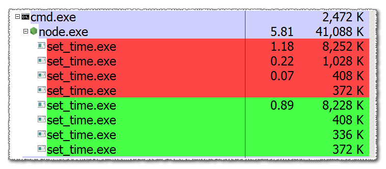

a .Net command-line application to set creation/last-access/last-modified data and time, accepts UTC Unix-time (seconds since epoch).


You can download the sharp-develop project and exe in https://github.com/eladkarako/set_time/ .

since this task can run on background, and does not change or lock the access to the resource (does it?) 

you don't have to let it run in an sync way, you don't need to convert the buffer to utf-8 either, there is no callback, and no addressing any error or success.

```js
....

      ,set_time_exe       = RESOLVE(FOLDER_ROOT + "/_resources/set_time/set_time.exe")
      ,exec_file          = require("child_process").execFile //.execFileSync //run in async (background might still run...)
....

  exec_file(set_time_exe
          ,["--target"                 , article.path_full
           ,"--set-time-creation"      , btime
           ,"--set-time-last-modified" , mtime
         //,"--verbose"
          ]
          ,{"timeout"      : 10 * 1000
         //,"encoding"    : "utf8"
           ,"windowsHide" : true
           ,"shell"       : false
           }
          );

```





need to include it as ._exe_ ....